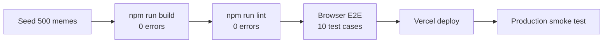

# Meme Data Collection App — Implementation Plan

> Brand: **MemeConsole** · Next.js 14 + Supabase + Tailwind CSS · Vercel deploy · Zero mock data
>
> **Skills legend:** 🏗️ `senior-architect` · 🧑‍💻 `senior-fullstack` · 🗄️ `database-design` · 🎨 `ui-ux-pro-max` · 🧹 `clean-code` · 🧪 `webapp-testing` · 🚀 `vercel-deployment`

---

## Resolved Decisions

| # | Topic | Resolution |
|---|-------|------------|
| 1 | Registration field options | **Docs** — Progressive/Moderate/Conservative/Apolitical · Not Religious/Moderately Religious/Very Religious · Casual User/Meme Savvy/Chronically Online |
| 2 | Survey question options | **Docs** — 5pt Likert scales, 3-option moderation (Keep/Flag/Remove) |
| 3 | Brand name | **MemeConsole** everywhere |
| 4 | Gallery features | **Docs** — progress bar + meme grid only, no search/filters/upload |
| 5 | Admin extras | **Remove all** decorative elements (no map, CTA, extra nav, partner logos) |

---

## Phase 0 — Project Bootstrap

### Task 0.1: Scaffold Next.js 14 Project
**Skills:** 🏗️ `senior-architect` + 🧑‍💻 `senior-fullstack`

Architect decides the project initialization flags ensuring App Router, TypeScript, and `src/` directory are used. Fullstack executes scaffolding.

```bash
npx -y create-next-app@latest ./ \
  --typescript --tailwind --eslint --app --src-dir \
  --import-alias "@/*" --no-turbopack
```

**Definition of Done:**
- [ ] Project initializes without errors in `/home/emon-morol/All_Projects/data-collection/`
- [ ] `npm run dev` starts on `localhost:3000` and renders the default Next.js page
- [ ] `tsconfig.json` has `@/*` path alias configured
- [ ] Tailwind CSS is active (test by adding a `text-red-500` class and seeing red text)

---

### Task 0.2: Configure Tailwind Design System
**Skills:** 🏗️ `senior-architect` + 🎨 `ui-ux-pro-max`

Architect defines the design token structure. UI/UX skill extracts exact tokens from the 5 HTML designs and configures `tailwind.config.ts`.

**Design tokens to configure:**

| Token | Value | Source |
|-------|-------|--------|
| `colors.primary` | `#7C3AED` | All pages |
| `colors.background-dark` | `#0B0118` | Registration |
| `colors.card-dark` | `#161129` | Gallery, Annotation |
| `colors.surface-dark` | `#161021` | Admin |
| `colors.border-dark` | `#252530` | All pages |
| `fontFamily.display` | `Plus Jakarta Sans, Inter, sans-serif` | Registration headings |
| `fontFamily.body` | `Inter, sans-serif` | All body text |
| `fontFamily.bangla` | `Hind Siliguri, sans-serif` | Annotation Bangla caption |
| `borderRadius.DEFAULT` | `12px` | All pages |

**Definition of Done:**
- [ ] `tailwind.config.ts` contains all tokens above
- [ ] All 3 Google Fonts loaded via `<link>` in `layout.tsx`
- [ ] A test element using `bg-primary text-white` renders correctly as purple

---

### Task 0.3: Create Global CSS Utilities
**Skills:** 🎨 `ui-ux-pro-max` + 🧹 `clean-code`

UI/UX extracts shared CSS patterns from all 5 HTML designs into reusable utility classes. Clean-code ensures no duplication.

**Utilities to create in `globals.css`:**

| Class | Purpose | CSS Properties |
|-------|---------|---------------|
| `.glass-card` | Glassmorphism card container | `background: rgba(22,16,33,0.7); backdrop-filter: blur(12px); border: 1px solid rgba(255,255,255,0.08)` |
| `.glow-button` | Purple CTA with glow | `box-shadow: 0 0 20px rgba(124,58,237,0.4); &:hover { transform: translateY(-2px) }` |
| `.progress-gradient` | Gradient fill for progress bars | `background: linear-gradient(90deg, #7C3AED, #A78BFA)` |
| `.custom-scrollbar` | Styled scrollbar for panels | Thin track, primary-colored thumb |

**Definition of Done:**
- [ ] `globals.css` contains all 4 utility classes
- [ ] Each class works when applied to a test `<div>` on the default page
- [ ] Dark mode is the default (`class="dark"` on `<html>`)

---

### Task 0.4: Set Up Environment Variables
**Skills:** 🏗️ `senior-architect` + 🧑‍💻 `senior-fullstack`

Architect specifies what env vars are needed and their security classification (public vs server-only). Fullstack creates the template.

**Required variables:**

| Variable | Scope | Purpose |
|----------|-------|---------|
| `NEXT_PUBLIC_SUPABASE_URL` | Public | Supabase project URL |
| `NEXT_PUBLIC_SUPABASE_ANON_KEY` | Public | Supabase anonymous key (read-only) |
| `SUPABASE_SERVICE_ROLE_KEY` | Server-only | Supabase admin key (bypasses RLS) |
| `ADMIN_USERNAME` | Server-only | Static admin login username |
| `ADMIN_PASSWORD` | Server-only | Static admin login password |
| `SESSION_SECRET` | Server-only | JWT signing key (min 32 chars) |

**Definition of Done:**
- [ ] `.env.local` file exists with all 6 variables (placeholders marked with `<REPLACE>`)
- [ ] `.env.local` is listed in `.gitignore`
- [ ] `.env.example` exists with same keys but no values, committed to git

---

### Task 0.5: Create Folder Structure
**Skills:** 🏗️ `senior-architect`

Architect designs the route group structure for clean separation of auth, dashboard, and admin concerns.

```
src/
├── app/
│   ├── layout.tsx              # Root: fonts, metadata, <html class="dark">
│   ├── page.tsx                # "/" → redirect to /login
│   ├── globals.css
│   ├── (auth)/
│   │   ├── login/page.tsx
│   │   └── register/page.tsx
│   ├── (dashboard)/
│   │   ├── layout.tsx          # Wraps NavBar + auth guard
│   │   ├── gallery/page.tsx
│   │   └── meme/[id]/page.tsx
│   ├── (admin)/
│   │   ├── layout.tsx          # Wraps admin NavBar + admin guard
│   │   └── admin/page.tsx
│   └── api/
│       ├── auth/{register,login,logout,check-username}/route.ts
│       ├── responses/{route.ts,[id]/route.ts}
│       └── admin/{stats,download}/route.ts
├── components/
│   ├── NavBar.tsx
│   ├── MemeCard.tsx
│   ├── SurveyForm.tsx
│   ├── ProgressBar.tsx
│   └── ui/{SegmentedPills,AgeInput,SliderInput,RadioCards,GlowButton,Toast,Skeleton}.tsx
├── lib/
│   ├── supabase.ts
│   └── auth.ts
└── middleware.ts
```

**Definition of Done:**
- [ ] All directories exist (files can be placeholder/empty)
- [ ] Route groups `(auth)`, `(dashboard)`, `(admin)` are created
- [ ] `npm run dev` still runs without errors

---

## Phase 1 — Database & Seed Script

### Task 1.1: Create Database Tables
**Skills:** 🏗️ `senior-architect` + 🗄️ `database-design` + 🧑‍💻 `senior-fullstack`

Architect validates the schema design. Database-design skill handles normalization, constraints, and relationships. Fullstack executes the SQL in Supabase.

```sql
CREATE TABLE annotators (
  id SERIAL PRIMARY KEY,
  username TEXT UNIQUE NOT NULL,
  password_hash TEXT NOT NULL,
  age INTEGER NOT NULL CHECK (age >= 13 AND age <= 100),
  political_outlook TEXT NOT NULL
    CHECK (political_outlook IN ('Progressive','Moderate','Conservative','Apolitical')),
  religious_perspective TEXT NOT NULL
    CHECK (religious_perspective IN ('Not Religious','Moderately Religious','Very Religious')),
  internet_literacy TEXT NOT NULL
    CHECK (internet_literacy IN ('Casual User','Meme Savvy','Chronically Online')),
  dark_humor_tolerance INTEGER NOT NULL CHECK (dark_humor_tolerance BETWEEN 1 AND 10),
  created_at TIMESTAMPTZ DEFAULT NOW()
);

CREATE TABLE meme_bank (
  id SERIAL PRIMARY KEY,
  image_name TEXT UNIQUE NOT NULL,
  caption TEXT NOT NULL,
  ground_truth_label TEXT NOT NULL,
  display_order INTEGER NOT NULL
);

CREATE TABLE meme_reviews (
  id SERIAL PRIMARY KEY,
  annotator_id INTEGER NOT NULL REFERENCES annotators(id) ON DELETE CASCADE,
  meme_id INTEGER NOT NULL REFERENCES meme_bank(id) ON DELETE CASCADE,
  perception TEXT NOT NULL
    CHECK (perception IN ('Very Negative','Negative','Neutral','Positive','Very Positive')),
  is_offensive TEXT NOT NULL
    CHECK (is_offensive IN ('Strongly Disagree','Disagree','Neutral','Agree','Strongly Agree')),
  contains_vulgarity BOOLEAN NOT NULL,
  primary_target TEXT NOT NULL
    CHECK (primary_target IN ('None/General','Political Figure','Religious Group','Gender/Identity','Individual')),
  moderation_decision TEXT NOT NULL
    CHECK (moderation_decision IN ('Keep','Flag/Filter','Remove')),
  created_at TIMESTAMPTZ DEFAULT NOW(),
  UNIQUE (annotator_id, meme_id)
);
```

**Definition of Done:**
- [ ] All 3 tables exist in Supabase with all columns, types, and CHECK constraints
- [ ] Foreign keys are correct: `meme_reviews.annotator_id → annotators.id`, `meme_reviews.meme_id → meme_bank.id`
- [ ] UNIQUE constraint on `(annotator_id, meme_id)` prevents duplicate reviews
- [ ] `ON DELETE CASCADE` confirmed — deleting an annotator removes their reviews

---

### Task 1.2: Create Indexes
**Skills:** 🗄️ `database-design` + 🧑‍💻 `senior-fullstack`

Database-design identifies the query patterns and creates indexes to optimize them.

```sql
CREATE INDEX idx_reviews_annotator ON meme_reviews(annotator_id);
CREATE INDEX idx_reviews_meme ON meme_reviews(meme_id);
CREATE INDEX idx_meme_bank_order ON meme_bank(display_order);
```

**Definition of Done:**
- [ ] 3 indexes exist in Supabase (verify via `\di` or dashboard)
- [ ] `EXPLAIN ANALYZE` on `SELECT * FROM meme_reviews WHERE annotator_id = 1` shows index scan

---

### Task 1.3: Enable Row Level Security
**Skills:** 🏗️ `senior-architect` + 🗄️ `database-design`

Architect designs the RLS policy structure. Database-design implements policies.

> [!IMPORTANT]
> Since we use the **service role key** server-side (which bypasses RLS), RLS primarily guards against direct Supabase client abuse. Our API routes handle auth via middleware + session cookies.

```sql
ALTER TABLE annotators ENABLE ROW LEVEL SECURITY;
ALTER TABLE meme_bank ENABLE ROW LEVEL SECURITY;
ALTER TABLE meme_reviews ENABLE ROW LEVEL SECURITY;

-- Service role key bypasses all RLS — used in API routes
-- Anon key (if ever used client-side) gets no access by default
```

**Definition of Done:**
- [ ] RLS is enabled on all 3 tables
- [ ] Using anon key directly returns 0 rows (RLS blocks)
- [ ] Using service role key returns all rows (RLS bypassed)

---

### Task 1.4: Write Seed Script
**Skills:** 🧑‍💻 `senior-fullstack` + 🧹 `clean-code`

Fullstack writes the seed script. Clean-code ensures proper error handling, logging, and idempotency.

**Script logic:**
1. Read `Stratified_Dataset/training.csv`, `validation.csv`, `testing.csv`
2. Parse CSV columns: `image_name`, `Captions` (→ `caption`), `Label` (→ `ground_truth_label`)
3. Deduplicate by `image_name` (keep first occurrence)
4. Assign `display_order` = 1, 2, 3... sequentially
5. UPSERT into `meme_bank` using Supabase service role key
6. Log: `Seeded X memes successfully`

**Definition of Done:**
- [ ] `scripts/seed.ts` exists and runs via `npx tsx scripts/seed.ts`
- [ ] `SELECT COUNT(*) FROM meme_bank` returns exactly 500
- [ ] Each row has valid `image_name`, `caption` (Bangla text), `ground_truth_label`, and `display_order` (1–500)
- [ ] Running the script again does not create duplicates (idempotent via UPSERT)

---

### Task 1.5: Symlink Meme Images
**Skills:** 🧑‍💻 `senior-fullstack`

```bash
ln -s ../Stratified_Dataset/Img public/memes
```

**Definition of Done:**
- [ ] `/public/memes/` resolves to `Stratified_Dataset/Img/`
- [ ] `http://localhost:3000/memes/fb%201424.jpg` serves an image successfully
- [ ] Total of ~500 images accessible via the symlink

---

## Phase 2 — Authentication System

### Task 2.1: Supabase Client Library
**Skills:** 🏗️ `senior-architect` + 🧑‍💻 `senior-fullstack`

Architect decides on server vs client instantiation patterns. Fullstack implements.

**File: `src/lib/supabase.ts`**
- `createServerSupabaseClient()` — uses `SUPABASE_SERVICE_ROLE_KEY` for server-side operations (bypasses RLS)
- `createBrowserSupabaseClient()` — uses `NEXT_PUBLIC_SUPABASE_ANON_KEY` for client-side reads (if needed)

**Definition of Done:**
- [ ] Both functions export correctly and connect to Supabase without errors
- [ ] Server client can `SELECT COUNT(*) FROM meme_bank` and returns 500
- [ ] Client uses env vars, not hardcoded values

---

### Task 2.2: Auth Library
**Skills:** 🏗️ `senior-architect` + 🧑‍💻 `senior-fullstack` + 🧹 `clean-code`

Architect designs session strategy (JWT in HTTP-only cookie). Fullstack implements. Clean-code ensures proper typing and error handling.

**File: `src/lib/auth.ts`**

| Function | Signature | Logic |
|----------|-----------|-------|
| `hashPassword` | `(password: string) → Promise<string>` | `bcrypt.hash(password, 12)` |
| `verifyPassword` | `(password: string, hash: string) → Promise<boolean>` | `bcrypt.compare(password, hash)` |
| `createSession` | `(userId: number, role: 'user'\|'admin') → string` | Sign JWT with `{userId, role}`, set HTTP-only cookie `session` with `SameSite=Strict`, `Secure`, `HttpOnly`, `Path=/`, `MaxAge=86400` |
| `getSession` | `(cookies: ReadonlyRequestCookies) → {userId, role}\|null` | Verify JWT from `session` cookie, return payload or null |
| `destroySession` | `() → void` | Set `session` cookie with `MaxAge=0` |

**Definition of Done:**
- [ ] `hashPassword('test123')` returns a bcrypt hash starting with `$2b$12$`
- [ ] `verifyPassword('test123', hash)` returns `true`
- [ ] `createSession` sets a cookie that `getSession` can decode
- [ ] `destroySession` clears the cookie
- [ ] JWT contains `userId` and `role` claims
- [ ] Cookie flags are all correct: `HttpOnly=true`, `Secure=true` (prod), `SameSite=Strict`

---

### Task 2.3: Route Protection Middleware
**Skills:** 🏗️ `senior-architect` + 🧑‍💻 `senior-fullstack`

Architect defines the route protection matrix. Fullstack implements as Next.js middleware.

**File: `src/middleware.ts`**

| Route Pattern | Auth Required | Role | Action |
|---------------|:---:|:---:|--------|
| `/login`, `/register` | ❌ | — | If already authed → redirect to `/gallery` |
| `/gallery`, `/meme/*` | ✅ | User | If not authed → redirect to `/login` |
| `/admin` | ✅ | Admin | If not authed → redirect `/login`. If user (not admin) → 403 page |
| `/api/auth/*` | ❌ | — | Pass through |
| `/api/responses/*` | ✅ | User | If not authed → 401 JSON |
| `/api/admin/*` | ✅ | Admin | If not admin → 403 JSON |

**Definition of Done:**
- [ ] Visiting `/gallery` without session → redirects to `/login`
- [ ] Visiting `/login` with valid session → redirects to `/gallery`
- [ ] Visiting `/admin` with user session → shows 403
- [ ] Visiting `/admin` with admin session → shows page
- [ ] `GET /api/responses` without session → 401 JSON
- [ ] `GET /api/admin/stats` without admin session → 403 JSON
- [ ] Middleware runs on all routes specified in the `matcher` config

---

### Task 2.4: Registration API
**Skills:** 🧑‍💻 `senior-fullstack` + 🧹 `clean-code`

**File: `src/app/api/auth/register/route.ts`**

**Logic:**
1. Parse JSON body → validate all 7 fields (type + constraints)
2. Check if username already exists → 409 if taken
3. `bcrypt.hash(password, 12)` → get `password_hash`
4. `INSERT INTO annotators (username, password_hash, age, ...)` → get `id`
5. `createSession(id, 'user')` → set cookie
6. Return `{success: true, userId: id}`

**Validation rules (from docs):**

| Field | Type | Constraint |
|-------|------|------------|
| `username` | string | min 3 chars, unique |
| `password` | string | min 6 chars |
| `age` | integer | 13–100 |
| `political_outlook` | string | one of: Progressive, Moderate, Conservative, Apolitical |
| `religious_perspective` | string | one of: Not Religious, Moderately Religious, Very Religious |
| `internet_literacy` | string | one of: Casual User, Meme Savvy, Chronically Online |
| `dark_humor_tolerance` | integer | 1–10 |

**Definition of Done:**
- [ ] `POST /api/auth/register` with valid body → 201, user in DB, session cookie set
- [ ] Duplicate username → 409 error response
- [ ] Missing/invalid field → 400 with specific field error message
- [ ] Password stored as bcrypt hash, never plaintext
- [ ] After successful registration, accessing `/gallery` works (session is valid)

---

### Task 2.5: Login API
**Skills:** 🏗️ `senior-architect` + 🧑‍💻 `senior-fullstack` + 🧹 `clean-code`

**File: `src/app/api/auth/login/route.ts`**

**Logic:**
1. Parse JSON body → validate `username` + `password` present
2. Check admin: `username === env.ADMIN_USERNAME && password === env.ADMIN_PASSWORD`
   - If match → `createSession(0, 'admin')` → return `{role: 'admin'}`
3. Check DB user: `SELECT * FROM annotators WHERE username = ?`
   - If found → `bcrypt.compare(password, row.password_hash)`
   - If match → `createSession(row.id, 'user')` → return `{role: 'user'}`
4. Neither → 401 `"Invalid username or password"` (generic message, no info leak)

**Definition of Done:**
- [ ] Admin login with correct env credentials → 200, `role: 'admin'`, session cookie set
- [ ] User login with correct DB credentials → 200, `role: 'user'`, session cookie set
- [ ] Wrong password → 401 with generic error (doesn't reveal if username exists)
- [ ] Non-existent username → 401 with same generic error
- [ ] Empty fields → 400

---

### Task 2.6: Logout API
**Skills:** 🧑‍💻 `senior-fullstack`

**File: `src/app/api/auth/logout/route.ts`**

**Logic:** Clear session cookie → return `{success: true}`

**Definition of Done:**
- [ ] `POST /api/auth/logout` → clears `session` cookie
- [ ] After logout, `/gallery` redirects to `/login`

---

### Task 2.7: Username Availability Check
**Skills:** 🧑‍💻 `senior-fullstack`

**File: `src/app/api/auth/check-username/route.ts`**

**Logic:** `SELECT id FROM annotators WHERE username = ?` → return `{available: boolean}`

**Definition of Done:**
- [ ] `GET /api/auth/check-username?u=newuser` → `{available: true}` if not taken
- [ ] `GET /api/auth/check-username?u=existinguser` → `{available: false}` if taken
- [ ] Missing `u` param → 400
- [ ] Response time < 200ms

---

## Phase 3 — Registration Page (`/register`)

### Task 3.1: Registration Page Layout & Background
**Skills:** 🏗️ `senior-architect` + 🎨 `ui-ux-pro-max` + 🧑‍💻 `senior-fullstack`

Architect ensures component composition follows the hierarchy from `system_architecture.md`. UI/UX replicates the exact visual design. Fullstack wires the data flow.

**File: `src/app/(auth)/register/page.tsx`**

**Layout structure (from UX docs + UI design):**
- Full-page dark background with radial purple gradient + floating blur orbs
- Top navbar: "MemeConsole" logo left, "Login" link right
- Centered `glass-card` container (`max-w-2xl`)
- Two sections inside card:
  1. **Credentials:** Username input (with real-time availability badge) + Password input (eye toggle)
  2. **About You:** Age stepper + Political Outlook pills + Religious Perspective pills + Internet Literacy pills + Dark Humor Tolerance slider
- Full-width "Register as Annotator →" glow button
- "Already have an account? Log in" link below
- Footer with copyright

**Definition of Done:**
- [ ] Page renders at `/register` with dark gradient background and floating orbs
- [ ] Nav bar shows "MemeConsole" branding and "Login" link that routes to `/login`
- [ ] Glass card with `backdrop-filter: blur` is centered on the page
- [ ] Two clearly labeled sections: "Credentials" and "About You"
- [ ] Visual fidelity matches the UI design screenshot (structure, spacing, glass effect)
- [ ] Responsive: card is full-width with padding on mobile (<480px), pills stack to 2 rows

---

### Task 3.2: Interactive Form Components
**Skills:** 🎨 `ui-ux-pro-max` + 🧑‍💻 `senior-fullstack` + 🧹 `clean-code`

Build reusable components used by the registration form.

**Components to build:**

| Component | File | Props | Behavior |
|-----------|------|-------|----------|
| `SegmentedPills` | `src/components/ui/SegmentedPills.tsx` | `options: string[], value, onChange, label` | Horizontal pill buttons, one selected at a time, keyboard nav with arrow keys, selected = purple bg |
| `AgeInput` | `src/components/ui/AgeInput.tsx` | `value, onChange, min=13, max=100` | Number with − / + buttons, clamped to range |
| `SliderInput` | `src/components/ui/SliderInput.tsx` | `value, onChange, min=1, max=10, leftLabel, rightLabel` | Range slider, snap-to-integer, floating value label above thumb, tick marks |
| `GlowButton` | `src/components/ui/GlowButton.tsx` | `children, disabled, loading, onClick, type` | Purple button with glow shadow, spinner when loading, disabled state |

**Definition of Done:**
- [ ] All 4 components render correctly in isolation
- [ ] `SegmentedPills` highlights exactly one option, arrow keys navigate between options
- [ ] `AgeInput` cannot go below 13 or above 100 — buttons disable at bounds
- [ ] `SliderInput` shows current value (e.g. "8") next to the slider, labels show "SAFE FOR WORK" ↔ "EDGE OF THE ABYSS"
- [ ] `GlowButton` shows spinner when `loading=true`, is non-clickable when `disabled=true`
- [ ] All components accept `focus-visible` styling for accessibility

---

### Task 3.3: Form Logic & Submission
**Skills:** 🧑‍💻 `senior-fullstack` + 🏗️ `senior-architect` + 🧹 `clean-code`

Architect validates the data flow. Fullstack implements client-side logic + API integration.

**Behaviors (from UX docs):**
1. Username input: debounced 500ms call to `GET /api/auth/check-username` → shows green "✓ AVAILABLE" or red "✗ TAKEN" badge
2. Password input: eye-toggle, min 6 chars hint below
3. All 7 fields required — "Register" button disabled until all valid
4. On submit: show spinner in button, disable all inputs
5. Success → redirect to `/gallery` with "Welcome, {username}!" toast
6. Error → inline field-level error below the offending field, auto-scroll + focus to first error

**Definition of Done:**
- [ ] Username availability badge appears after 500ms of typing, ✓ or ✗
- [ ] Password eye toggle works (shows/hides text)
- [ ] Button is disabled when any field is empty/invalid
- [ ] Submitting valid form → POST to `/api/auth/register` → redirect to `/gallery`
- [ ] Duplicate username → inline error below username field
- [ ] Server validation error → first errored field gets focus and scroll

---

## Phase 4 — Login Page (`/login`)

### Task 4.1: Login Page UI
**Skills:** 🏗️ `senior-architect` + 🎨 `ui-ux-pro-max` + 🧑‍💻 `senior-fullstack`

**File: `src/app/(auth)/login/page.tsx`**

**Layout (from UX docs + UI design):**
- Mesh gradient background with purple radial gradients
- Centered card (`max-w-md`) with glassmorphism border
- App icon + "MemeConsole" heading + "Access the meme data collection & research suite" subtitle
- Username input (person icon prefix, auto-focus on load)
- Password input (lock icon prefix, eye-toggle)
- "Remember this device" checkbox
- "Sign In →" purple button (disabled when either field empty, spinner on submit)
- Divider + "Don't have an account? Register now" link
- Footer: "Privacy Policy · Terms of Service · Support"

**Definition of Done:**
- [ ] Page renders at `/login` with mesh gradient background
- [ ] Username field auto-focuses on page load
- [ ] Password eye-toggle shows/hides text
- [ ] "Sign In" button disabled until both fields have content
- [ ] Clicking "Register now" navigates to `/register`
- [ ] Submit → spinner in button → POST to `/api/auth/login`
- [ ] Admin login → redirect to `/admin`
- [ ] User login → redirect to `/gallery`
- [ ] Invalid credentials → "Invalid username or password" below password field (generic, no info leak)
- [ ] Enter key in password field triggers submit
- [ ] Visual fidelity matches login UI design screenshot
- [ ] Responsive: card centered on all viewports

---

## Phase 5 — Gallery Page (`/gallery`)

### Task 5.1: Gallery API Endpoint
**Skills:** 🏗️ `senior-architect` + 🧑‍💻 `senior-fullstack` + 🗄️ `database-design`

**File: `src/app/api/responses/route.ts` (GET handler)**

**Query:**
```sql
SELECT m.*, (r.id IS NOT NULL) AS reviewed
FROM meme_bank m
LEFT JOIN meme_reviews r ON m.id = r.meme_id AND r.annotator_id = $1
ORDER BY m.display_order ASC
```

**Response shape:**
```json
{
  "memes": [
    { "id": 1, "image_name": "fb 1424.jpg", "caption": "...", "display_order": 1, "reviewed": true },
    ...
  ],
  "completedCount": 128,
  "totalCount": 500,
  "firstIncompleteOrder": 129
}
```

**Definition of Done:**
- [ ] `GET /api/responses` returns all 500 memes with `reviewed` boolean per current user
- [ ] `completedCount` accurately reflects number of reviews by this user
- [ ] `firstIncompleteOrder` points to the first meme without a review
- [ ] Response is sorted by `display_order` ascending
- [ ] 401 if no valid session

---

### Task 5.2: Gallery Page UI
**Skills:** 🏗️ `senior-architect` + 🎨 `ui-ux-pro-max` + 🧑‍💻 `senior-fullstack`

**File: `src/app/(dashboard)/gallery/page.tsx`**

**Layout (from UX docs + UI design):**
- **Sticky navbar:** "MemeConsole" logo, nav links (Gallery active), user profile badge (username), logout button
- **Progress section:** Glass card with:
  - Progress bar (gradient fill, proportional)
  - "X of 500 memes annotated" text
  - "XX.X% complete" percentage
  - "Continue →" button → navigates to first incomplete meme
  - If all done → "All Done! 🎉" and button disabled
- **Meme grid:** CSS Grid (5 cols desktop → 3 tablet → 2 mobile)
  - Each `MemeCard`: square thumbnail, corner status badge (✅=done, ○=pending), meme number below
  - On hover: `translateY(-8px)` lift + shadow
  - On click: navigate to `/meme/[display_order]`
- Skeleton grid while loading (fixed-dimension slots to prevent CLS)
- Lazy loading images (`loading="lazy"`)

**Definition of Done:**
- [ ] Page renders at `/gallery` with all memes from the DB
- [ ] Progress bar fills proportionally (e.g. 128/500 = 25.6%)
- [ ] Percentage and count text are accurate
- [ ] "Continue" button navigates to the first incomplete meme's `/meme/[order]`
- [ ] Each meme card shows thumbnail from `/memes/[image_name]`
- [ ] Completed memes have green ✅ badge, pending have ○ badge
- [ ] Clicking a card navigates to `/meme/[display_order]`
- [ ] Grid is responsive: 5 → 3 → 2 columns as viewport shrinks
- [ ] Progress section stacks vertically on mobile, button becomes full-width
- [ ] Skeleton loaders show while data fetches
- [ ] Images use `loading="lazy"` and have explicit width/height
- [ ] 0 CLS when images load

---

### Task 5.3: NavBar Component
**Skills:** 🏗️ `senior-architect` + 🎨 `ui-ux-pro-max` + 🧹 `clean-code`

**File: `src/components/NavBar.tsx`**

Shared across gallery, annotation, and admin pages. Adapts based on context.

**Props:** `variant: 'user' | 'admin'`, `username: string`, `currentPage?: string`

**Definition of Done:**
- [ ] "MemeConsole" branding with icon on all pages
- [ ] User variant: shows username, logout button
- [ ] Admin variant: shows "Admin", logout button
- [ ] Active page has visual indicator (underline/weight)
- [ ] Fixed to top, `backdrop-blur`, `z-50`
- [ ] Mobile: compact with overflow menu for links

---

### Task 5.4: MemeCard Component
**Skills:** 🎨 `ui-ux-pro-max` + 🧹 `clean-code`

**File: `src/components/MemeCard.tsx`**

**Props:** `id, imageName, displayOrder, reviewed, onClick`

**Definition of Done:**
- [ ] Renders square thumbnail using Next.js `<Image>` with `object-cover`
- [ ] Green ✅ badge in top-right corner if `reviewed=true`
- [ ] Empty ○ badge if `reviewed=false`
- [ ] Meme number shown below image (e.g. "#001")
- [ ] Hover: smooth lift (`translateY(-8px)`) + shadow increase
- [ ] Keyboard accessible: focusable, Enter triggers click

---

### Task 5.5: ProgressBar Component
**Skills:** 🎨 `ui-ux-pro-max`

**File: `src/components/ProgressBar.tsx`**

**Props:** `completed: number, total: number`

**Definition of Done:**
- [ ] Bar fills proportionally with gradient
- [ ] Shows "X of Y memes annotated" and "XX.X% complete"
- [ ] Animates fill on mount (if motion allowed)

---

## Phase 6 — Meme Annotation Page (`/meme/[id]`)

### Task 6.1: Meme Data API
**Skills:** 🏗️ `senior-architect` + 🧑‍💻 `senior-fullstack` + 🗄️ `database-design`

**File: `src/app/api/responses/[id]/route.ts` (GET)**

**Logic:** `[id]` = `display_order`. Fetch meme + existing review for current user.

```sql
SELECT * FROM meme_bank WHERE display_order = $1;
SELECT * FROM meme_reviews WHERE meme_id = $memeId AND annotator_id = $userId;
```

**Response:**
```json
{
  "meme": { "id": 42, "image_name": "fb 1424.jpg", "caption": "বাংলা...", "display_order": 42 },
  "existingReview": { "perception": "Neutral", ... } | null,
  "totalMemes": 500,
  "userCompletedCount": 41
}
```

**Definition of Done:**
- [ ] `GET /api/responses/42` returns meme at display_order=42
- [ ] If user has reviewed this meme, `existingReview` is populated with all 5 fields
- [ ] If not reviewed, `existingReview` is `null`
- [ ] `totalMemes` and `userCompletedCount` are accurate
- [ ] 404 if display_order doesn't exist
- [ ] 401 if no session

---

### Task 6.2: Submit/Update Review API
**Skills:** 🧑‍💻 `senior-fullstack` + 🗄️ `database-design` + 🧹 `clean-code`

**File: `src/app/api/responses/route.ts` (POST)**

**Logic:** UPSERT — insert new review or update existing one.

```sql
INSERT INTO meme_reviews (annotator_id, meme_id, perception, is_offensive, contains_vulgarity, primary_target, moderation_decision)
VALUES ($1, $2, $3, $4, $5, $6, $7)
ON CONFLICT (annotator_id, meme_id)
DO UPDATE SET perception=$3, is_offensive=$4, contains_vulgarity=$5, primary_target=$6, moderation_decision=$7;
```

**Validation:**

| Field | Type | Allowed Values |
|-------|------|----------------|
| `meme_id` | integer | must exist in `meme_bank` |
| `perception` | string | Very Negative, Negative, Neutral, Positive, Very Positive |
| `is_offensive` | string | Strongly Disagree, Disagree, Neutral, Agree, Strongly Agree |
| `contains_vulgarity` | boolean | true, false |
| `primary_target` | string | None/General, Political Figure, Religious Group, Gender/Identity, Individual |
| `moderation_decision` | string | Keep, Flag/Filter, Remove |

**Definition of Done:**
- [ ] `POST /api/responses` with valid body → 201, review saved in DB
- [ ] Submitting again for same meme → 200, existing review updated (not duplicated)
- [ ] Invalid field value (e.g. perception="Bad") → 400 with field-level error
- [ ] Missing required field → 400
- [ ] Non-existent meme_id → 404
- [ ] 401 if no session

---

### Task 6.3: Annotation Page UI
**Skills:** 🏗️ `senior-architect` + 🎨 `ui-ux-pro-max` + 🧑‍💻 `senior-fullstack`

**File: `src/app/(dashboard)/meme/[id]/page.tsx`**

**Layout (from UX docs + UI design):**

- **Navbar:** "MemeConsole" logo, "Meme X / 500" counter with mini progress bar, Settings button
- **Desktop (≥1024px):** Two-column, 50/50 split
  - **Left panel:** Meme image (gradient border glow, `object-contain`, max 60vh), Bangla caption below in `font-bangla` with `lang="bn"` attribute, "TRANSCRIPTION (BANGLA)" label
  - **Right panel:** "Annotation Task" heading, 5 survey questions with styled controls (see below), scrollable with `custom-scrollbar`
- **Mobile (<1024px):** Single column — image on top (scrolls away), form below
- **Sticky footer:** "← PREVIOUS" (disabled on meme 1) | "SUBMIT & NEXT →" (disabled until all 5 answered)

**Survey question UI style (from UI design HTML, with docs option values):**

| Q# | Question | UI Style | Options (from docs) |
|----|----------|----------|-------------------| 
| 1 | General Perception | Icon-labeled cards in horizontal row | Very Negative · Negative · Neutral · Positive · Very Positive |
| 2 | Is it offensive? | Horizontal pill buttons (uppercase) | Strongly Disagree · Disagree · Neutral · Agree · Strongly Agree |
| 3 | Contains vulgarity? | Two large radio cards | Yes · No |
| 4 | Primary Target | Icon-labeled cards in 2×2 grid + 1 | None/General · Political Figure · Religious Group · Gender/Identity · Individual |
| 5 | Moderation Decision | Three buttons in dashed container | Keep · Flag/Filter · Remove |

**Definition of Done:**
- [ ] Page renders at `/meme/42` with correct meme image and Bangla caption
- [ ] Image loads from `/memes/[image_name]` with `object-contain` and gradient border
- [ ] Caption uses Bangla font (Hind Siliguri) with `lang="bn"` attribute
- [ ] All 5 survey questions render with correct options and styled controls
- [ ] Selecting an option highlights it with purple background
- [ ] "SUBMIT & NEXT" button disabled until all 5 questions answered
- [ ] Submitting → spinner → POST to API → navigate to `/meme/[id+1]`
- [ ] "PREVIOUS" navigates to `/meme/[id-1]`, disabled on meme 1
- [ ] If last meme (500), button reads "SUBMIT & FINISH" → redirects to `/gallery`
- [ ] Pre-fill: If previously reviewed, all radio buttons pre-select previous answers
- [ ] Modifying pre-filled answers and submitting updates (not creates) the review
- [ ] Desktop: two-column layout with sticky left panel
- [ ] Mobile: single column, image scrolls away
- [ ] Footer is sticky at bottom on all viewports
- [ ] Keyboard: ← = previous, → = submit & next (if all answered), 1-5 = jump to question

---

### Task 6.4: SurveyForm & RadioCards Components
**Skills:** 🎨 `ui-ux-pro-max` + 🧑‍💻 `senior-fullstack` + 🧹 `clean-code`

**Files:** `src/components/SurveyForm.tsx`, `src/components/ui/RadioCards.tsx`

**SurveyForm:** Contains all 5 questions, manages form state, calls `onChange` with complete answer set.

**RadioCards:** Reusable component for styled radio groups.
- **Props:** `name, options: {value, label, icon?}[], value, onChange, layout: 'horizontal'|'grid'`
- Selected option: purple bg, white text
- Unselected: dark bg, border, hover tint
- Keyboard navigable with arrow keys

**Definition of Done:**
- [ ] `SurveyForm` exposes `answers` state and `isComplete` boolean
- [ ] `RadioCards` renders in both horizontal row and 2-col grid layouts
- [ ] Arrow keys navigate between options
- [ ] Full row/card is clickable (not just the radio circle)
- [ ] Selected state is visually distinct (purple bg)
- [ ] Focus ring visible on keyboard navigation
- [ ] Touch targets ≥ 44×44px

---

## Phase 7 — Admin Dashboard (`/admin`)

### Task 7.1: Admin Stats API
**Skills:** 🏗️ `senior-architect` + 🧑‍💻 `senior-fullstack` + 🗄️ `database-design`

**File: `src/app/api/admin/stats/route.ts`**

**Queries:**
```sql
SELECT COUNT(*) as total_users FROM annotators;
SELECT COUNT(*) as total_reviews FROM meme_reviews;
SELECT COUNT(DISTINCT annotator_id) as active_annotators FROM meme_reviews;
```
**Computed:** `completionRate = (total_reviews / (total_users × 500)) × 100`

**Definition of Done:**
- [ ] `GET /api/admin/stats` returns `{totalUsers, totalReviews, activeAnnotators, completionRate}`
- [ ] `completionRate` is a float with 1 decimal (e.g. `34.8`)
- [ ] All numbers match actual DB state
- [ ] 403 if caller is not admin

---

### Task 7.2: CSV Download API
**Skills:** 🧑‍💻 `senior-fullstack` + 🧹 `clean-code`

**File: `src/app/api/admin/download/route.ts`**

**`?type=users`:**
```sql
SELECT id, username, age, political_outlook, religious_perspective,
       internet_literacy, dark_humor_tolerance, created_at
FROM annotators ORDER BY id;
```
→ Stream as `user_details.csv` (excludes `password_hash`)

**`?type=reviews`:**
```sql
SELECT r.id, a.username, m.image_name, m.display_order,
       r.perception, r.is_offensive, r.contains_vulgarity,
       r.primary_target, r.moderation_decision, r.created_at
FROM meme_reviews r
JOIN annotators a ON r.annotator_id = a.id
JOIN meme_bank m ON r.meme_id = m.id
ORDER BY r.id;
```
→ Stream as `meme_reviews.csv`

**Definition of Done:**
- [ ] `GET /api/admin/download?type=users` triggers browser download of `user_details.csv`
- [ ] CSV has correct headers and data, no `password_hash` column
- [ ] `GET /api/admin/download?type=reviews` triggers download of `meme_reviews.csv`
- [ ] CSV includes `username`, `image_name`, `display_order` alongside review fields
- [ ] Invalid `type` param → 400
- [ ] 403 if not admin
- [ ] Content-Type is `text/csv`, Content-Disposition forces download

---

### Task 7.3: Admin Dashboard UI
**Skills:** 🏗️ `senior-architect` + 🎨 `ui-ux-pro-max` + 🧑‍💻 `senior-fullstack`

**File: `src/app/(admin)/admin/page.tsx`**

**Layout (from UX docs + UI design, decorative elements REMOVED):**
- **Navbar:** "MemeConsole" logo, "Dashboard" active link, admin avatar, logout
- **Header:** "Admin Management Console" + "Overview of meme data collection and annotation progress"
- **Stats cards** (4-col grid → 2 → 1 responsive):
  - Total Users — groups icon, large number
  - Total Reviews — rate_review icon, large number
  - Active Annotators — edit_note icon, large number
  - Completion Rate — pie_chart icon, percentage + mini progress bar
- **Export section:** Glass card with:
  - "Export Data for Research" heading + description
  - Two side-by-side download cards (User Details, Meme Reviews), each with icon, title, description, download button
- **REMOVED from UI design:** geographic map, "Accelerate Research" CTA, extra nav links, footer partner logos

**Definition of Done:**
- [ ] Page renders at `/admin` with real numbers from DB (not mock data)
- [ ] All 4 stat cards show accurate data from `GET /api/admin/stats`
- [ ] Stats have count-up animation on mount (respects `prefers-reduced-motion`)
- [ ] Completion rate card has mini progress bar that fills proportionally
- [ ] "Download User Details CSV" button triggers file download
- [ ] "Download Meme Reviews CSV" button triggers file download
- [ ] Both CSVs open correctly in Excel/Google Sheets
- [ ] No decorative elements: no map, no CTA, no extra nav, no partner logos
- [ ] Responsive: stat cards 4→2→1 cols, download cards stack on mobile
- [ ] Non-admin accessing `/admin` → 403 page with link back to `/gallery`

---

## Phase 8 — Security & Polish

### Task 8.1: Rate Limiting
**Skills:** 🏗️ `senior-architect` + 🧑‍💻 `senior-fullstack`

Rate limit `/api/auth/login` to 5 attempts per minute per IP using an in-memory Map with TTL.

**Definition of Done:**
- [ ] 6th login attempt within 60 seconds → 429 "Too Many Requests"
- [ ] Counter resets after 60 seconds
- [ ] Does not affect other endpoints

---

### Task 8.2: Security Headers
**Skills:** 🏗️ `senior-architect` + 🧑‍💻 `senior-fullstack`

**File: `next.config.js`**

Add headers: `Content-Security-Policy`, `X-Frame-Options: DENY`, `X-Content-Type-Options: nosniff`, `Referrer-Policy: strict-origin-when-cross-origin`

**Definition of Done:**
- [ ] Response headers include all 4 security headers
- [ ] CSP allows `self`, Google Fonts CDN, Supabase domain
- [ ] Page does not break with CSP enabled

---

### Task 8.3: Toast Notification System
**Skills:** 🎨 `ui-ux-pro-max` + 🧑‍💻 `senior-fullstack`

**File: `src/components/ui/Toast.tsx`**

From UX docs: slides in from top-right, auto-dismisses after 3 seconds.

**Definition of Done:**
- [ ] `showToast('Welcome!', 'success')` shows green toast in top-right
- [ ] `showToast('Error', 'error')` shows red toast
- [ ] Auto-dismisses after 3 seconds
- [ ] Multiple toasts stack vertically
- [ ] Respects `prefers-reduced-motion` (no slide animation)

---

### Task 8.4: Skeleton Loading Components
**Skills:** 🎨 `ui-ux-pro-max`

**File: `src/components/ui/Skeleton.tsx`**

**Definition of Done:**
- [ ] Gallery shows skeleton grid of 10 cards while loading
- [ ] Annotation page shows skeleton for image + form while loading
- [ ] Admin shows skeleton for stats cards while loading
- [ ] Skeletons have shimmer animation

---

### Task 8.5: Accessibility Audit
**Skills:** 🎨 `ui-ux-pro-max` + 🧹 `clean-code`

From UX docs shared patterns:

**Definition of Done:**
- [ ] All interactive elements have `:focus-visible` ring
- [ ] All touch targets ≥ 44×44px
- [ ] All form inputs use `<label>` elements
- [ ] Bangla caption has `lang="bn"` attribute
- [ ] `prefers-reduced-motion` disables animations
- [ ] Color contrast ratios ≥ 4.5:1 for text
- [ ] All images have `alt` text

---

## Phase 9 — Testing & Deployment

### Task 9.1: Seed Verification
**Skills:** 🧑‍💻 `senior-fullstack` + 🗄️ `database-design`

**Definition of Done:**
- [ ] `SELECT COUNT(*) FROM meme_bank` = 500
- [ ] Every `image_name` in `meme_bank` has a corresponding file in `/public/memes/`
- [ ] `display_order` is contiguous 1–500

---

### Task 9.2: Build & Lint
**Skills:** 🧑‍💻 `senior-fullstack` + 🧹 `clean-code`

**Definition of Done:**
- [ ] `npm run build` completes with 0 errors
- [ ] `npm run lint` completes with 0 errors
- [ ] No TypeScript type errors

---

### Task 9.3: E2E Browser Testing
**Skills:** 🧪 `webapp-testing`

| Test | Steps | Expected |
|------|-------|----------|
| Registration | `/register` → fill all 7 fields → submit | Redirect to `/gallery`, user in DB |
| Login | `/login` → enter creds → submit | Redirect to `/gallery` |
| Admin Login | Login with admin env creds | Redirect to `/admin` |
| Gallery | View `/gallery` | Progress 0/500, 500 meme cards, "Continue" → `/meme/1` |
| Annotation | `/meme/1` → answer all 5 → "Submit & Next" | Review in DB, redirect to `/meme/2` |
| Pre-fill | Navigate back to `/meme/1` | Previous answers pre-filled |
| Admin Stats | `/admin` | Real numbers from DB |
| CSV Download | Click both download buttons | Valid CSVs with correct data |
| Auth Guard | `/admin` as regular user | 403 |
| Auth Guard | `/gallery` unauthenticated | Redirect to `/login` |

**Definition of Done:**
- [ ] All 10 tests pass in browser
- [ ] Screenshots captured for each test step

---

### Task 9.4: Deploy to Vercel
**Skills:** 🚀 `vercel-deployment` + 🏗️ `senior-architect`

**Definition of Done:**
- [ ] Project deployed to Vercel with custom subdomain
- [ ] All 6 env vars configured in Vercel dashboard
- [ ] Production build succeeds
- [ ] Full user flow works on production URL
- [ ] Images serve correctly from Vercel CDN
- [ ] Security headers present in production responses

---

## Verification Plan Summary


