# Meme Data Collection Website — System Architecture

> Comprehensive system architecture for a Next.js + Supabase research tool that collects survey responses on ~500 Bangla memes. Designed for deployment on **Vercel**.

---

## Table of Contents

1. [High-Level System Overview](#1-high-level-system-overview)
2. [Component Architecture](#2-component-architecture)
3. [Page-by-Page Breakdown](#3-page-by-page-breakdown)
4. [Data Flow Architecture](#4-data-flow-architecture)
5. [Database Design](#5-database-design)
6. [API Architecture](#6-api-architecture)
7. [Authentication & Authorization Flow](#7-authentication--authorization-flow)
8. [Deployment Topology](#8-deployment-topology)
9. [Security Architecture](#9-security-architecture)
10. [Performance & Scalability](#10-performance--scalability)

---

## 1. High-Level System Overview

```mermaid
graph TB
    subgraph "Client Layer"
        Browser["🌐 Browser (Desktop/Mobile)"]
    end

    subgraph "Application Layer — Vercel Edge Network"
        NextJS["⚡ Next.js 14 App Router<br/>(SSR + API Routes)"]
    end

    subgraph "Data Layer — Supabase Cloud"
        SupaAuth["🔐 Supabase Client"]
        SupaDB["🐘 PostgreSQL Database"]
    end

    subgraph "Static Assets"
        Memes["🖼️ /public/memes/<br/>~500 Bangla Meme Images"]
        StaticCSS["🎨 Tailwind CSS"]
    end

    Browser -->|"HTTPS Requests"| NextJS
    NextJS -->|"Server-side queries"| SupaDB
    NextJS -->|"Auth validation"| SupaAuth
    NextJS -->|"Serve static files"| Memes
    NextJS -->|"Styles"| StaticCSS
    SupaAuth -->|"User sessions"| SupaDB
```



### Key Architecture Decisions

| Decision | Rationale |
|----------|-----------|
| **Next.js 14 App Router** | Server Components for data fetching, API routes co-located, built-in SSR |
| **Supabase PostgreSQL** | Free tier (500 MB DB), managed PostgreSQL, built-in Row Level Security |
| **Static admin auth** | Simplicity; only 1 admin needed, env-var-based credentials |
| **Tailwind CSS** | Rapid UI development, utility-first, great Next.js integration |
| **Vercel deployment** | Zero-config Next.js hosting, global CDN, serverless functions |
| **Local image serving** | No external storage costs; images served via `/public/memes/` symlink |

---

## 2. Component Architecture

### 2.1 Frontend Component Hierarchy


### 2.2 Backend Module Architecture


---

## 3. Page-by-Page Breakdown

### 3.1 Registration Page — `/register`


**Components Used:**
- `<RegisterPage>` — Full form with 7 fields
- `<RadioGroup>` — For dropdowns (political_outlook, religious_perspective, internet_literacy)
- `<Button>` — Submit action
- Text input — username, password
- Number input — age
- Slider/select — dark_humor_tolerance (1–10)

**Validation Rules:**
| Field | Rule |
|-------|------|
| username | Required, unique, min 3 chars |
| password | Required, min 6 chars, bcrypt hashed server-side |
| age | Required, integer, 13–100 |
| political_outlook | Required, one of: Progressive, Moderate, Conservative, Apolitical |
| religious_perspective | Required, one of: Not Religious, Moderately Religious, Very Religious |
| internet_literacy | Required, one of: Casual User, Meme Savvy, Chronically Online |
| dark_humor_tolerance | Required, integer 1–10 |

---

### 3.2 Login Page — `/login`


**Components Used:**
- `<LoginPage>` — Username + password form
- `<Button>` — Submit
- Shared auth layout wrapper

**Logic:**
1. First checks if credentials match `ADMIN_USERNAME` / `ADMIN_PASSWORD` from env vars
2. If not admin, queries `annotators` table and verifies bcrypt hash
3. Sets HTTP-only session cookie on success
4. Redirects: admin → `/admin`, user → `/gallery`

---

### 3.3 Gallery Page — `/gallery`

```mermaid
sequenceDiagram
    actor User
    participant Gallery as Gallery Page
    participant API as GET /api/responses
    participant DB as Supabase PostgreSQL

    User->>Gallery: Navigate to gallery
    Gallery->>API: Fetch all memes + user's review status
    API->>DB: SELECT m.*, (r.id IS NOT NULL) as reviewed<br/>FROM meme_bank m<br/>LEFT JOIN meme_reviews r<br/>ON m.id = r.meme_id AND r.annotator_id = ?
    DB-->>API: 500 memes with review status
    API-->>Gallery: Meme list + completion data

    Note over Gallery: Render: Progress bar (X/500),<br/>meme cards with ✅/⬜ indicators,<br/>"Continue" button

    User->>Gallery: Click "Continue"
    Gallery->>User: Navigate to first incomplete meme
```



**Components Used:**
- `<GalleryPage>` — Main page container
- `<ProgressBar>` — Shows `X / 500` completed
- `<MemeCard>` — Thumbnail + status icon (✅ completed, ⬜ pending)
- `<NavBar>` — Navigation with logout
- `<Button>` — "Continue" to first incomplete meme

**Data Flow:**
- Server-side fetch: all 500 memes + LEFT JOIN with user's reviews
- Computed: `completedCount`, `firstIncompleteId`
- UI state: scroll position, loading state

---

### 3.4 Meme Review Page — `/meme/[id]`


**Components Used:**
- `<MemePage>` — Container with meme display + survey
- `<SurveyForm>` — 5 required questions with radio buttons
- `<RadioGroup>` — For each question
- `<Button>` — "Previous", "Submit & Next"
- `<NavBar>` — Back to gallery link

**Survey Questions Detail:**

| # | Question | Input Type | Options |
|---|----------|------------|---------|
| 1 | How do you perceive this meme? | Radio | Very Negative, Negative, Neutral, Positive, Very Positive |
| 2 | Is this meme offensive to any group? | Radio | Strongly Disagree, Disagree, Neutral, Agree, Strongly Agree |
| 3 | Contains Vulgarity? | Radio | Yes, No |
| 4 | Primary Target (if any) | Radio | None/General, Political Figure, Religious Group, Gender/Identity, Individual |
| 5 | Should this be removed from a general feed? | Radio | Keep, Flag/Filter, Remove |

**Navigation Logic:**
- **Previous:** `/meme/[id-1]` (disabled on first meme)
- **Submit & Next:** Save response → `/meme/[id+1]` (or gallery if last)
- **Back to Gallery:** Returns to `/gallery`

---

### 3.5 Admin Dashboard — `/admin`


**Components Used:**
- `<AdminDashboard>` — Stats cards + download buttons
- `<Button>` — CSV download triggers
- `<NavBar>` — Admin-specific nav with logout

**Admin Features:**
| Feature | Endpoint | Output |
|---------|----------|--------|
| Download User Details | `GET /api/admin/download?type=users` | `user_details.csv` — all annotator profiles (excluding password hashes) |
| Download Meme Reviews | `GET /api/admin/download?type=reviews` | `meme_review.csv` — all responses with annotator usernames |
| View Stats | Dashboard render | Total users, total reviews, completion % |

---

## 4. Data Flow Architecture

### 4.1 End-to-End Data Flow


### 4.2 Request/Response Data Flow


---

## 5. Database Design

### 5.1 Entity Relationship Diagram


### 5.2 Index Strategy

```sql
-- Primary keys (auto-indexed)
-- annotators.id, meme_bank.id, meme_reviews.id

-- Unique constraints (auto-indexed)
CREATE UNIQUE INDEX idx_annotators_username ON annotators(username);
CREATE UNIQUE INDEX idx_meme_bank_image ON meme_bank(image_name);
CREATE UNIQUE INDEX idx_reviews_unique ON meme_reviews(annotator_id, meme_id);

-- Query performance indexes
CREATE INDEX idx_reviews_annotator ON meme_reviews(annotator_id);
CREATE INDEX idx_reviews_meme ON meme_reviews(meme_id);
CREATE INDEX idx_meme_bank_order ON meme_bank(display_order);
```

### 5.3 Data Volume Estimates

| Table | Max Rows | Avg Row Size | Est. Total Size |
|-------|----------|-------------|-----------------|
| `annotators` | ~200 users | ~300 bytes | ~60 KB |
| `meme_bank` | ~500 memes | ~500 bytes | ~250 KB |
| `meme_reviews` | ~100,000 (200×500) | ~200 bytes | ~20 MB |
| **Total** | | | **~20.3 MB** |

> Well within Supabase free tier limit of **500 MB**.

### 5.4 Row Level Security (RLS) Policies

```sql
-- annotators: users can only read their own profile
ALTER TABLE annotators ENABLE ROW LEVEL SECURITY;
CREATE POLICY "Users read own profile" ON annotators
    FOR SELECT USING (id = current_user_id());

-- meme_bank: all authenticated users can read
ALTER TABLE meme_bank ENABLE ROW LEVEL SECURITY;
CREATE POLICY "Authenticated read memes" ON meme_bank
    FOR SELECT USING (auth.role() = 'authenticated');

-- meme_reviews: users can only CRUD their own reviews
ALTER TABLE meme_reviews ENABLE ROW LEVEL SECURITY;
CREATE POLICY "Users manage own reviews" ON meme_reviews
    FOR ALL USING (annotator_id = current_user_id());
```

---

## 6. API Architecture

### 6.1 API Route Map

```mermaid
graph TD
    subgraph "Auth Routes — /api/auth/"
        POST_Register["POST /register<br/>Create new annotator"]
        POST_Login["POST /login<br/>Authenticate user/admin"]
        POST_Logout["POST /logout<br/>Clear session"]
    end

    subgraph "Response Routes — /api/responses/"
        GET_Memes["GET /<br/>List all memes + review status"]
        GET_Meme["GET /[id]<br/>Get meme + existing review"]
        POST_Response["POST /<br/>Submit/update review"]
    end

    subgraph "Admin Routes — /api/admin/"
        GET_Stats["GET /stats<br/>Dashboard statistics"]
        GET_Download["GET /download?type=users|reviews<br/>Download CSV"]
    end
```



### 6.2 API Endpoint Specifications

| Method | Path | Auth | Request Body | Response |
|--------|------|------|-------------|----------|
| `POST` | `/api/auth/register` | None | `{username, password, age, ...}` | `{user, session}` |
| `POST` | `/api/auth/login` | None | `{username, password}` | `{user, session, role}` |
| `POST` | `/api/auth/logout` | User/Admin | — | `{success}` |
| `GET` | `/api/responses` | User | — | `{memes[], completedCount}` |
| `GET` | `/api/responses/[id]` | User | — | `{meme, existingReview?}` |
| `POST` | `/api/responses` | User | `{meme_id, perception, ...}` | `{review}` |
| `GET` | `/api/admin/stats` | Admin | — | `{totalUsers, totalReviews, ...}` |
| `GET` | `/api/admin/download` | Admin | `?type=users\|reviews` | CSV file stream |

---

## 7. Authentication & Authorization Flow

```mermaid
flowchart TD
    Start["User visits any page"]
    MW["Next.js Middleware"]
    Check{"Has valid<br/>session cookie?"}
    IsAuth{"Page requires<br/>auth?"}
    IsAdmin{"Is admin<br/>route?"}
    AdminCheck{"Session role<br/>= admin?"}

    LoginPage["Redirect to /login"]
    AllowAccess["Allow access"]
    ForbidAccess["403 Forbidden"]

    Start --> MW
    MW --> Check
    Check -->|No| IsAuth
    Check -->|Yes| IsAdmin
    IsAuth -->|No — public page| AllowAccess
    IsAuth -->|Yes| LoginPage
    IsAdmin -->|No — user route| AllowAccess
    IsAdmin -->|Yes| AdminCheck
    AdminCheck -->|Yes| AllowAccess
    AdminCheck -->|No| ForbidAccess
```



### Route Protection Matrix

| Route Pattern | Auth Required | Role Required | Middleware Action |
|---------------|:---:|:---:|---|
| `/login`, `/register` | ❌ | — | Redirect to `/gallery` if already logged in |
| `/gallery` | ✅ | User | Redirect to `/login` if unauthenticated |
| `/meme/[id]` | ✅ | User | Redirect to `/login` if unauthenticated |
| `/admin` | ✅ | Admin | Redirect to `/login` if not admin |
| `/api/auth/*` | ❌ | — | Open |
| `/api/responses/*` | ✅ | User | 401 if unauthenticated |
| `/api/admin/*` | ✅ | Admin | 403 if not admin |

---

## 8. Deployment Topology

### 8.1 Infrastructure Diagram

```mermaid
graph TB
    subgraph "Users"
        Annotator["👤 Annotators<br/>(~200 users)"]
        AdminUser["👑 Admin<br/>(1 user)"]
    end

    subgraph "CDN — Vercel Edge Network"
        Edge["🌐 Global CDN<br/>Static assets cached<br/>(CSS, JS, Images)"]
    end

    subgraph "Compute — Vercel Serverless"
        SSR_Fn["⚡ Serverless Functions<br/>Next.js SSR + API Routes<br/>(Node.js 18 Runtime)"]
    end

    subgraph "Data — Supabase Cloud"
        SupaPG["🐘 PostgreSQL 15<br/>(Supabase managed)<br/>Region: ap-southeast-1"]
    end

    subgraph "Static Files — Vercel Build Output"
        PublicMemes["🖼️ /public/memes/<br/>~500 PNG/JPG images"]
        NextStatic["📦 .next/static/<br/>JS bundles, CSS"]
    end

    Annotator -->|HTTPS| Edge
    AdminUser -->|HTTPS| Edge
    Edge -->|Cache HIT| PublicMemes
    Edge -->|Cache HIT| NextStatic
    Edge -->|Cache MISS<br/>Dynamic routes| SSR_Fn
    SSR_Fn -->|Supabase JS Client<br/>Connection pooling| SupaPG
```



### 8.2 Deployment Pipeline

```mermaid
flowchart LR
    Dev["💻 Local Dev<br/>npm run dev"]
    Git["📦 Git Push<br/>to main branch"]
    Vercel["🚀 Vercel CI/CD<br/>Auto-build"]
    Preview["🔍 Preview<br/>Deployment"]
    Prod["✅ Production<br/>Deployment"]

    Dev -->|"git push"| Git
    Git -->|"Webhook trigger"| Vercel
    Vercel -->|"PR branch"| Preview
    Vercel -->|"main branch"| Prod
```



### 8.3 Environment Configuration

| Environment | Variable | Source |
|-------------|----------|--------|
| **All** | `NEXT_PUBLIC_SUPABASE_URL` | Supabase dashboard |
| **All** | `NEXT_PUBLIC_SUPABASE_ANON_KEY` | Supabase dashboard |
| **Server-only** | `SUPABASE_SERVICE_ROLE_KEY` | Supabase dashboard |
| **Server-only** | `ADMIN_USERNAME` | Manual (env var) |
| **Server-only** | `ADMIN_PASSWORD` | Manual (env var) |
| **Local** | All above in `.env.local` | — |
| **Vercel** | All above in Vercel env settings | — |

### 8.4 Cost Analysis (Free Tier)

| Service | Tier | Limit | Expected Usage |
|---------|------|-------|----------------|
| **Vercel** | Hobby (Free) | 100 GB bandwidth/mo, 100K serverless invocations | ~5 GB bandwidth, ~50K invocations |
| **Supabase** | Free | 500 MB DB, 1 GB storage, 50K MAU | ~20 MB DB, ~200 MAU |
| **Domain** | N/A | Vercel `*.vercel.app` subdomain | Free |
| **Total** | | | **$0/month** |

---

## 9. Security Architecture

```mermaid
graph TD
    subgraph "Client Security"
        HTTPS["🔒 HTTPS Enforced"]
        CSP["Content Security Policy"]
        InputVal["Client-side Validation"]
    end

    subgraph "Middleware Security"
        CSRF["CSRF Protection"]
        RateLimit["Rate Limiting<br/>(Vercel built-in)"]
        CookieSec["HTTP-Only Secure Cookies"]
    end

    subgraph "Server Security"
        BcryptHash["bcrypt Password Hashing"]
        EnvVars["Secrets in Env Vars Only"]
        ParamQueries["Parameterized SQL Queries<br/>(via Supabase client)"]
    end

    subgraph "Database Security"
        RLS["Row Level Security (RLS)"]
        NoDirectAccess["No direct DB access<br/>from client"]
    end

    HTTPS --> CSRF
    CSP --> CSRF
    InputVal --> CSRF
    CSRF --> BcryptHash
    RateLimit --> BcryptHash
    CookieSec --> EnvVars
    BcryptHash --> RLS
    EnvVars --> RLS
    ParamQueries --> RLS
    RLS --> NoDirectAccess
```



### Security Measures Summary

| Threat | Mitigation |
|--------|-----------|
| **SQL Injection** | Supabase JS client uses parameterized queries |
| **XSS** | React auto-escaping + CSP headers |
| **CSRF** | SameSite cookie attribute + origin check |
| **Password theft** | bcrypt hashing (cost factor 12) |
| **Session hijacking** | HTTP-only, Secure, SameSite cookies |
| **Unauthorized access** | Middleware route protection + RLS |
| **Admin credential leak** | Credentials in env vars, never in source code |
| **Brute force** | Rate limiting on login endpoint |

---

## 10. Performance & Scalability

### 10.1 Caching Strategy

```mermaid
flowchart LR
    subgraph "Cache Layers"
        CDN["Vercel CDN Cache<br/>(Static assets: images, CSS, JS)<br/>TTL: Immutable"]
        ISR["ISR / Static Generation<br/>(Meme list — rarely changes)<br/>Revalidate: 3600s"]
        Runtime["Server-side Cache<br/>(User session data)<br/>In-memory per request"]
    end

    subgraph "No Cache"
        Dynamic["Dynamic Data<br/>(Reviews, user state)<br/>Always fresh from DB"]
    end
```



### 10.2 Performance Targets

| Metric | Target | Strategy |
|--------|--------|----------|
| **TTFB** | < 200ms | Server Components + Edge CDN |
| **LCP** | < 2.5s | Image optimization, lazy loading |
| **FID** | < 100ms | Minimal client-side JS |
| **CLS** | < 0.1 | Fixed image dimensions |
| **API Response** | < 300ms | Indexed queries, connection pooling |

### 10.3 Image Optimization

| Aspect | Approach |
|--------|----------|
| **Serving** | `/public/memes/` served via Vercel CDN |
| **Format** | Use Next.js `<Image>` component for auto WebP conversion |
| **Sizing** | Define explicit `width`/`height` to prevent CLS |
| **Loading** | `loading="lazy"` for below-fold images in gallery |
| **Caching** | Immutable cache headers for static images |

### 10.4 Scalability Boundaries

| Dimension | Current Capacity | Bottleneck | Mitigation |
|-----------|-----------------|------------|------------|
| **Users** | ~200 concurrent | Supabase free tier (50K MAU) | Upgrade to Pro tier if needed |
| **Memes** | ~500 | Static serving | Scale naturally |
| **Reviews** | ~100K rows | DB size (20 MB of 500 MB) | Well within limits |
| **API calls** | ~50K/month | Vercel hobby tier (100K) | Monitor usage |

---

## Appendix: Seed Script Flow

```mermaid
flowchart TD
    Start["Run: npx tsx scripts/seed.ts"]
    ReadCSV1["Read training.csv"]
    ReadCSV2["Read validation.csv"]
    ReadCSV3["Read testing.csv"]
    Parse["Parse all rows:<br/>image_name, caption, ground_truth_label"]
    Dedupe["Deduplicate by image_name"]
    Order["Assign display_order 1-N"]
    Insert["UPSERT INTO meme_bank"]
    Verify["Verify: SELECT COUNT(*) FROM meme_bank"]
    Done["✅ Seeded ~500 memes"]

    Start --> ReadCSV1
    Start --> ReadCSV2
    Start --> ReadCSV3
    ReadCSV1 --> Parse
    ReadCSV2 --> Parse
    ReadCSV3 --> Parse
    Parse --> Dedupe
    Dedupe --> Order
    Order --> Insert
    Insert --> Verify
    Verify --> Done
```


