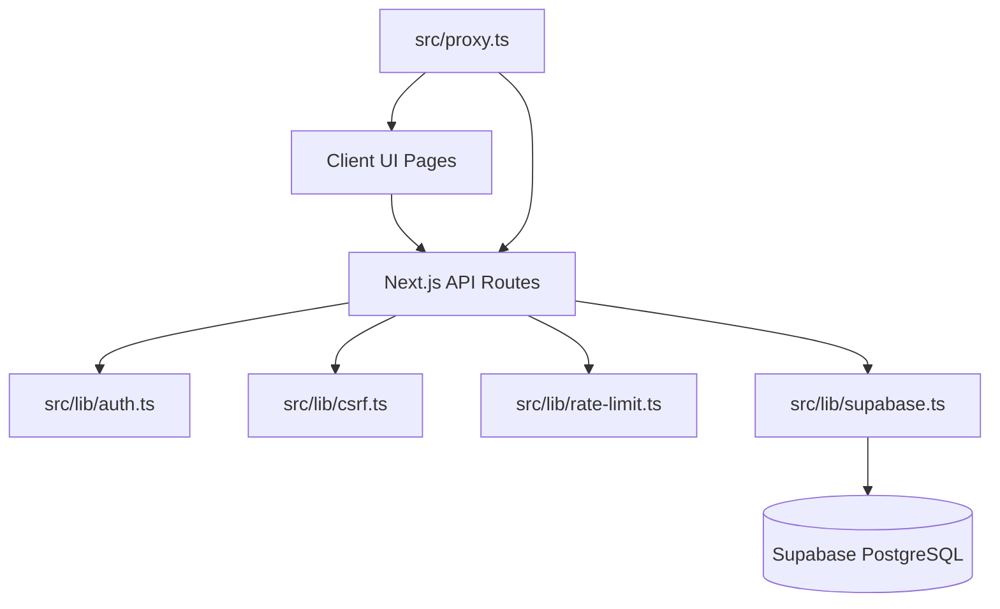

# Architecture

## Repository-level architecture

The app is a Next.js App Router project with route groups used to separate auth, annotator, and admin experiences.

| Route group | Purpose | Primary files |
|---|---|---|
| `(auth)` | login and registration | `src/app/(auth)/login/page.tsx`, `src/app/(auth)/register/page.tsx` |
| `(dashboard)` | annotator gallery + meme review | `src/app/(dashboard)/gallery/page.tsx`, `src/app/(dashboard)/meme/[id]/page.tsx` |
| `(admin)` | admin console | `src/app/(admin)/admin/page.tsx` |
| `api` | server routes | `src/app/api/**/route.ts` |

## Core runtime components

## Route lifecycle and access model

`src/proxy.ts` enforces role-aware routing before requests reach pages or protected APIs.

1. Public page routes: `/login`, `/register`.
2. User page routes: `/gallery`, `/meme/*`.
3. Admin page routes: `/admin`.
4. Public API routes: `/api/auth/*`.
5. User API routes: `/api/responses*`.
6. Admin API routes: `/api/admin*`.

Session payload expectations in proxy verification:

1. `userId`: number
2. `role`: `user` or `admin`
3. `iss`: equals configured issuer
4. `aud`: equals configured audience
5. `exp`: optional expiration, enforced when present

## Data architecture

Primary tables:

1. `annotators`
2. `meme_bank`
3. `meme_reviews`
4. `admins`

Main relationship model:

1. One annotator can create many reviews.
2. One meme can have many reviews from different annotators.
3. One annotator has at most one review per meme due to unique composite constraint.

## Static assets and dataset mapping

1. Image dataset source files live under `Stratified_Dataset/`.
2. Runtime image serving uses `public/memes/<image_name>`.
3. UI pages reference images with `src={`/memes/${encodeURIComponent(imageName)}`}`.

## Security architecture summary

1. Session cookie is `httpOnly`, `sameSite=strict`, path `/`, `secure` in production.
2. CSRF origin checks gate mutating routes.
3. Login endpoint includes rate-limit control with Upstash and fallback memory mode.
4. Next.js global response headers include CSP, X-Frame-Options, content-type sniff protection, and referrer policy.
5. Supabase RLS policies deny direct `anon`/`authenticated` access to all protected tables.

## Operational architecture summary

1. Seed script loads records from `training.csv`, `validation.csv`, `testing.csv`.
2. Admin seed script upserts a hashed admin password into `admins`.
3. Verification script checks 500 contiguous meme records and file existence in `public/memes`.
4. Playwright smoke script validates registration, annotation, user login, and optional admin flow.
