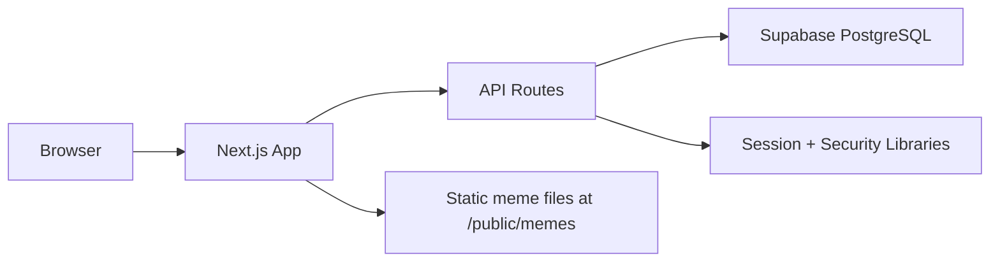

# MemeConsole Documentation

This MkDocs site is a complete implementation reference for the `meme-console` project in this repository.

## What this project is

MemeConsole is a research-oriented web platform used to collect structured annotations on Bangla memes.

It supports:

1. Annotator registration and login.
2. Sequential meme review workflows.
3. Admin analytics and CSV exports.
4. Security hardening for browser + API access.
5. Supabase-backed storage with seeded meme bank records.

## Technology stack

| Layer | Technology |
|---|---|
| Web app | Next.js 16 App Router |
| Language | TypeScript |
| UI | React 19 + Tailwind CSS v4 |
| Database | Supabase PostgreSQL |
| Auth/session | `bcryptjs` + JWT in `httpOnly` cookie |
| Deployment target | Vercel |
| Documentation | MkDocs + Material for MkDocs |

## Runtime and data model summary

## Documentation coverage map

1. `Getting Started`: full local setup and daily dev commands.
2. `Architecture`: route groups, user journeys, and system boundaries.
3. `Frontend`: design system, pages, and component behavior.
4. `Backend API`: each endpoint, validation, and response contract.
5. `Security`: proxy guards, CSRF checks, CSP headers, rate limiting.
6. `Database`: tables, constraints, migrations, RLS, seeding.
7. `Operations`: env vars, scripts, testing, deployment.
8. `Repository Reference`: file-by-file map of key project assets.
9. `Existing Project Docs`: imported original documents from `/docs`.

## Source location

This documentation site is intentionally isolated in:

`mkdocs-memeconsole-docs/`

That keeps the docs system separate from the app runtime while preserving all existing project files.
